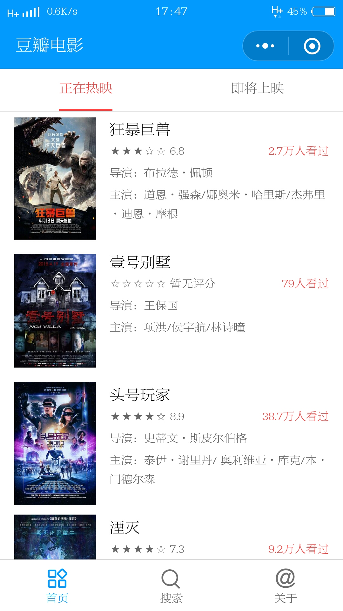
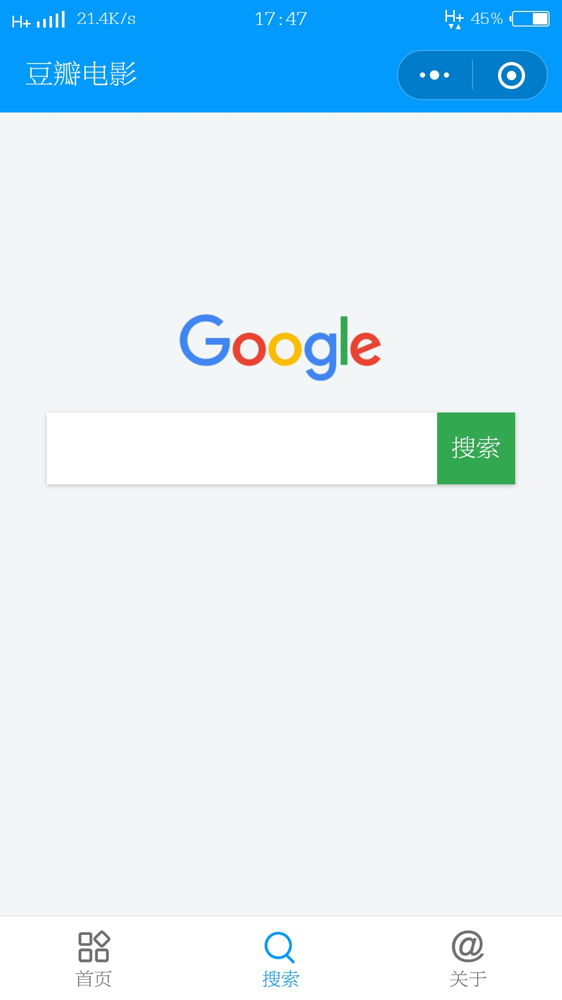
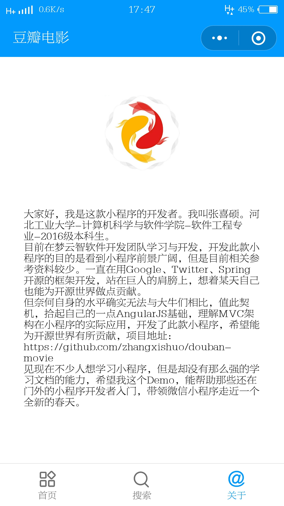
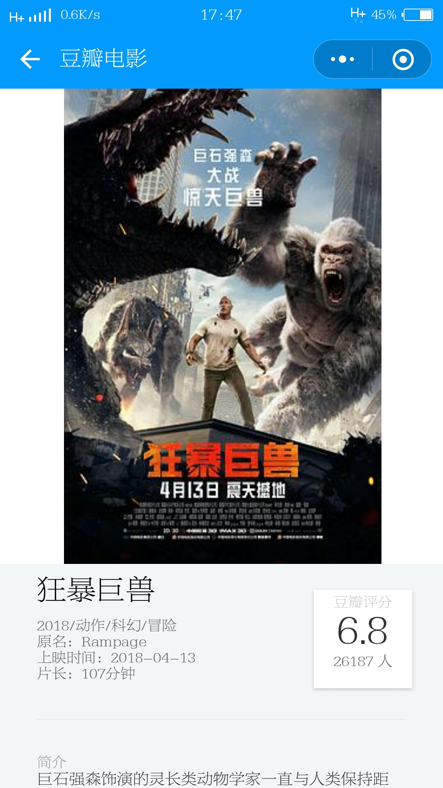

# 豆瓣电影


## 效果图









## 概述

豆瓣电影是使用豆瓣`api`，采用`ZanUI`开发的一款小程序。现主要包括：首页，搜索，关于，电影详情页功能。

豆瓣电影采用分层结构的设计思想，`page`主要用于请求数据，并显示加载中，加载完成之后将数据传入组件进行渲染。

组件用于展示数据，数据从调用组件时传入，组件进行渲染，同时调用`filter`目录下的过滤器进行数据过滤。

参考`AngularJS`开发中的思想建立了`service`，用于保存一些业务逻辑，用于外部调用，该小程序功能相对简单，因此`service`只对请求`api`的`request`进行了封装。

## 使用

```bash
git clone https://github.com/zhangxishuo/douban-movie.git
```

## 感谢

感谢开源社区的奉献。

[`ZanUI`](https://github.com/youzan/zanui-weapp)，高颜值、好用、易扩展的微信小程序 UI 库。

[`iconfont`](http://www.iconfont.cn/)，阿里巴巴适量图标库。

[豆瓣`api`代理](https://github.com/zce/douban-api-proxy)，一个豆瓣 API 的反向代理配置，旨在解决豆瓣屏蔽小程序请求问题（豆瓣接口 403 问题）。

